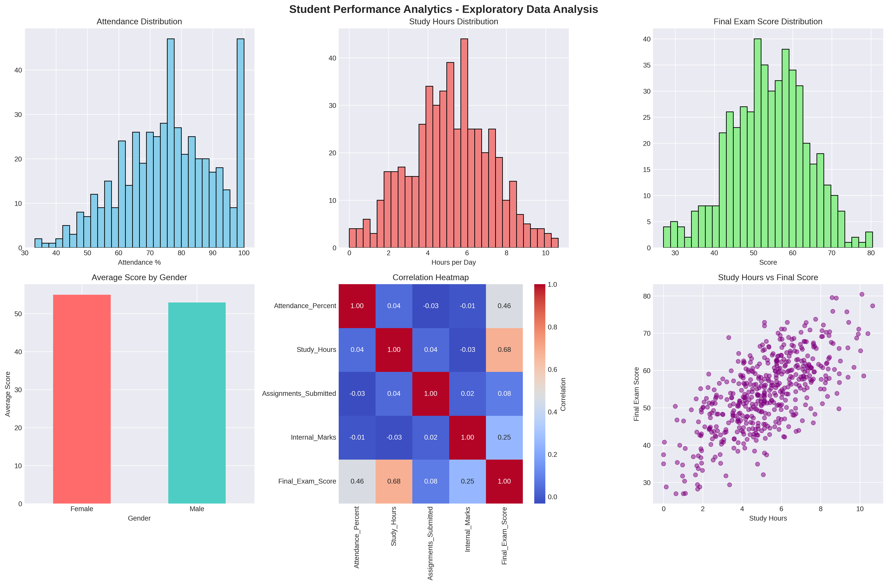
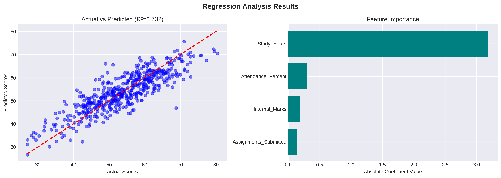
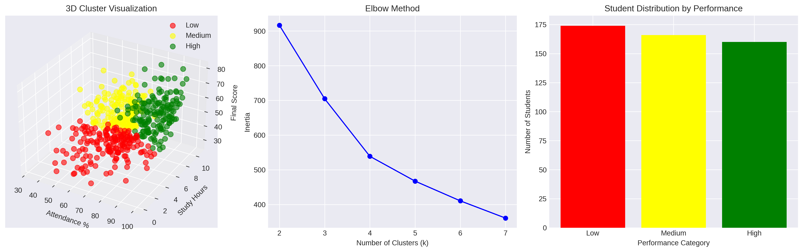
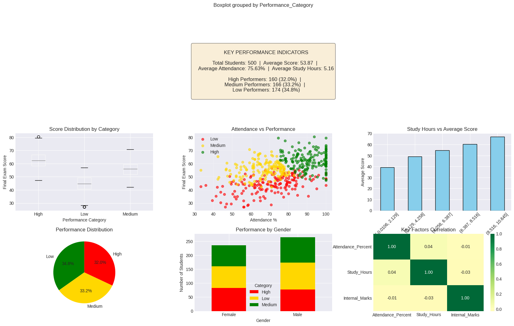

# Student Performance Analytics

**Project Timeline**
- Originally completed: 2022  
- Uploaded to GitHub: 2025  

---

## Overview
This project analyzes a student performance dataset to uncover key factors that influence academic outcomes.  
It demonstrates skills in **data cleaning, exploratory data analysis (EDA), hypothesis testing, regression modeling, and clustering**.  

The aim is to identify which factors (like **study hours, attendance, and assignments**) impact student exam performance and to group students into performance categories.

---

## Objectives
- **Data Cleaning** – Handle missing values, outliers, and standardize data.  
- **EDA & Visualization** – Explore study habits, attendance, and performance with charts.  
- **Statistical Analysis**  
  - Regression → predict final exam scores based on study hours & attendance.  
  - Hypothesis testing → test if gender/study habits significantly affect scores.  
- **Machine Learning (K-Means Clustering)** – Group students into High, Medium, and Low performance categories.  
- **Dashboard/Report** – Present insights in a simple dashboard/visual report.  

---

## Dataset
Dataset: Public Kaggle dataset or synthetic dataset with columns:  
- `Student_ID`  
- `Age`  
- `Gender`  
- `Attendance %`  
- `Study Hours`  
- `Assignments Submitted`  
- `Internal Marks`  
- `Final Exam Score`  

---

## Tools & Technologies
- **Python**: Pandas, NumPy, Matplotlib, Seaborn, Scikit-learn  
- **Jupyter Notebook / Google Colab**  
- **Excel / Tableau** (optional for dashboards)  

---

## Results & Insights
- **Student Performance Analytics** - Exploratory Data Analysis.

- **Regression analysis**

- **Clustering_analysis**

- **Students Performance**

---

## Deliverables
- `student-performance-analytics.ipynb` – Notebook with full code & explanations  
- **Visualizations**: scatter plots, bar charts, heatmaps  
- **Report/Portfolio page** summarizing methodology & results  

---
